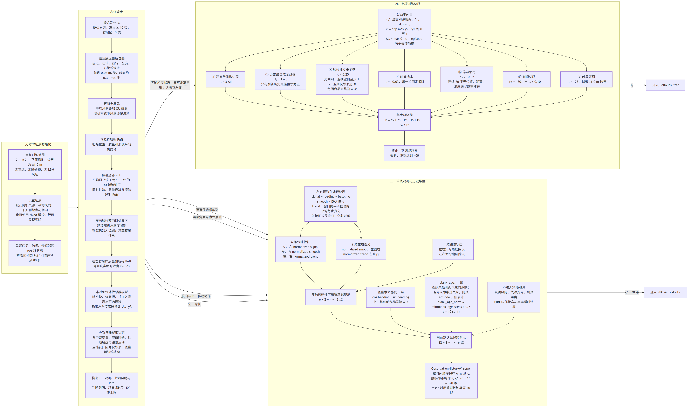
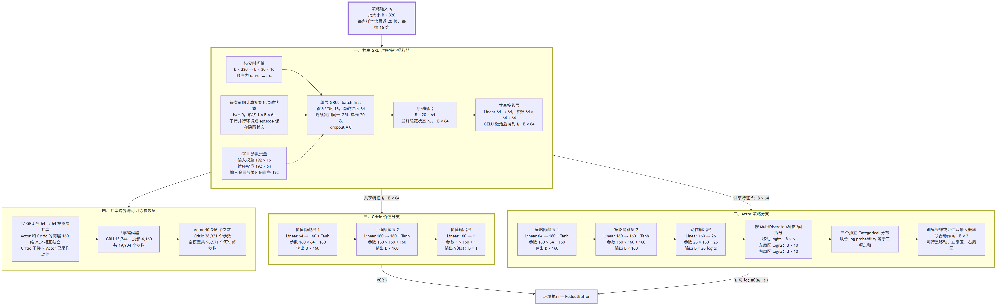
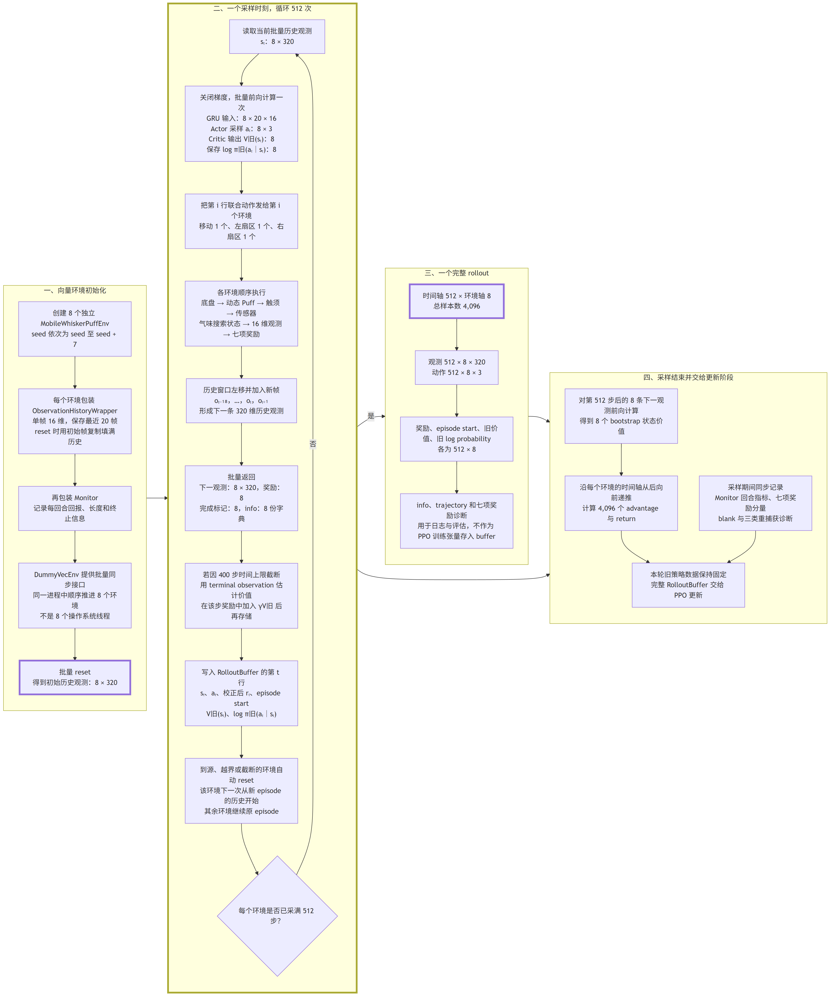
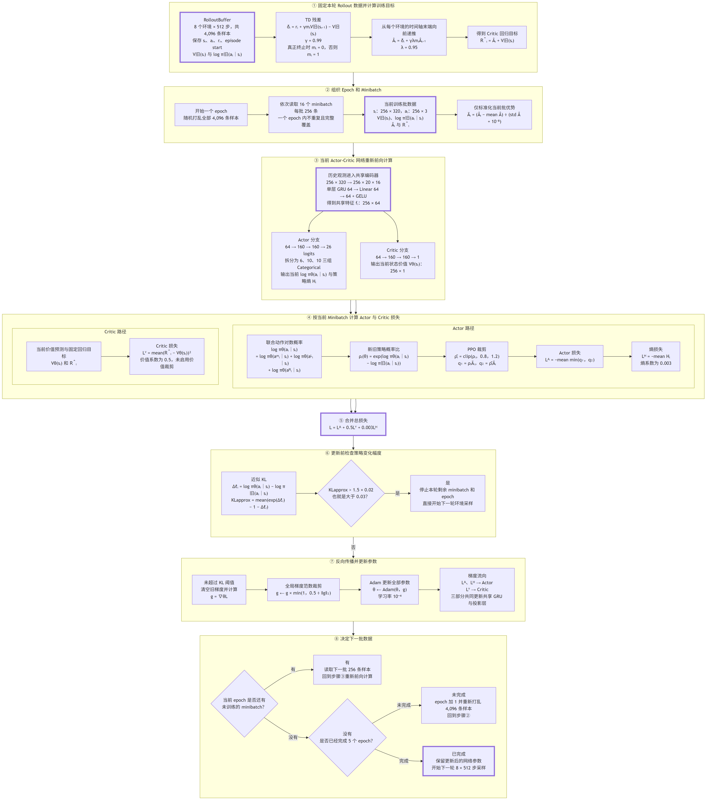

# PPO 训练四模块详细流程图

以下四图已按当前回退后的 `MobileWhiskerPuffEnv + GRU + PPO` 代码重新核对。当前算法只使用无障碍动态 Puff 羽流，不包含雷达避障、障碍碰撞或 LBM 风场。默认单帧观测为 16 维，20 帧历史输入为 320 维。代码变量 `blank_age` 保留原名：它表示连续未检测到气味的时长，不是额外传感器。

图中时间下标使用真正的小号 Unicode 字符，例如 `sₜ`、`aₜ`、`rₜ`；可编辑图源均为 Mermaid 文件。

## 图一：环境、观测与奖励构造

- [Mermaid 图源](figures/algorithm-environment-detail.mmd)
- [SVG 矢量图](figures/algorithm-environment-detail.svg)
- [PDF](figures/algorithm-environment-detail.pdf)

图中严格按照环境的一次 `step` 顺序展开：联合动作先更新底盘，再推进全局风与动态 Puff，随后更新触须、查询左右真实浓度、计算慢响应传感器读数，最后构造观测、七项奖励和终止状态。

## 图二：PPO Actor-Critic 网络逐层结构

- [Mermaid 图源](figures/algorithm-network-detail.mmd)
- [SVG 矢量图](figures/algorithm-network-detail.svg)
- [PDF](figures/algorithm-network-detail.pdf)

默认 GRU 网络的完整尺寸为 `320 → 20 × 16 → GRU 64 → Linear 64 → 64`。共享特征之后分成相互独立的 Actor 和 Critic：Actor 为 `64 → 160 → 160 → 26`，Critic 为 `64 → 160 → 160 → 1`。26 个动作 logits 按 `6 + 10 + 10` 拆成移动、左触须扇区和右触须扇区三个分类分布。

## 图三：8 环境 rollout 采样流程

- [Mermaid 图源](figures/algorithm-rollout-detail.mmd)
- [SVG 矢量图](figures/algorithm-rollout-detail.svg)
- [PDF](figures/algorithm-rollout-detail.pdf)

`DummyVecEnv` 对 8 个环境提供同步批量接口，但当前实现仍在同一进程内顺序执行环境步骤。策略前向计算被批量化为 `8 × 320`；每个环境采集 512 步后形成 `8 × 512 = 4,096` 条样本。

## 图四：PPO 参数更新与梯度路径

- [Mermaid 图源](figures/algorithm-update-detail.mmd)
- [SVG 矢量图](figures/algorithm-update-detail.svg)
- [PDF](figures/algorithm-update-detail.pdf)

每个 epoch 将 4,096 条样本重新打乱并切成 16 个、每个 256 条的 minibatch，因此一个 epoch 内样本不重复且完整覆盖；最多训练 5 个 epoch，即每轮 rollout 最多执行 80 次梯度更新。若近似 KL 超过 `0.03`，当前 PPO 更新会提前结束。

## 严格解释边界

- 策略观测只有 12 维双触须硬件可部署特征、3 维底盘本体感受和 1 维 `blank_age_norm`。真实风向、气源方向、真实到源距离、Puff 内部状态与真实瞬时浓度均不进入策略网络。
- 真实到源距离仅用于距离势函数奖励、到源判断和评估，不是策略输入。
- 20 帧按从旧到新的顺序输入 GRU：`oₜ₋₁₉，…，oₜ`。特征提取器每次前向计算都以全零隐藏状态开始，靠这 20 帧显式历史重建当前时序特征。
- Actor 和 Critic 只共享 GRU 与 64 维特征投影；两套 160 维 MLP 不共享。共享编码器同时接收策略损失、熵损失和价值损失的梯度。
- `info`、环境内部 `trajectory`、七项奖励分量和重捕获类别只用于记录与评估，不作为 PPO 的额外训练输入。
