# Mobile 双触须主动嗅觉算法模块图

本文聚焦当前开发主线 `MobileWhiskerPuffEnv + PPO`，并把**训练数据循环、网络逐层结构和 PPO 参数更新**放在最前面。后续系统图用于说明训练环境如何产生观测和奖励。图中粗箭头表示观测/训练张量，普通实线表示执行或参数更新流，虚线表示三选一网络分支，点划线表示训练或评估可用、但绝不进入策略观测的特权信息。

## PPO 训练闭环（主图）

```mermaid
flowchart LR
    subgraph ENV[一、环境与观测构造]
        direction TB
        CONFIG[训练配置<br/>8 个并行环境<br/>每环境采样 512 步<br/>历史长度 20]
        RESET[初始化场景与环境状态]
        OBS[生成单帧观测<br/>无障碍 16 维 / 障碍 28 维]
        HISTORY[历史观测构造<br/>堆叠最近 20 帧<br/>形成 320 / 560 维输入]

        CONFIG --> RESET --> OBS
        OBS -->|单帧观测：16 / 28 维| HISTORY
    end

    subgraph POLICY[二、PPO Actor-Critic 网络]
        direction TB
        GRU[时序编码层<br/>输入恢复为 20 × 16 / 20 × 28<br/>1 层 GRU：输入维度至 64]
        PROJ[特征投影层<br/>1 层 Linear：64 至 64<br/>GELU 激活]
        ACTOR[Actor 策略分支<br/>隐藏层 1：64 至 160 + Tanh<br/>隐藏层 2：160 至 160 + Tanh<br/>动作层：160 至 26]
        CRITIC[Critic 价值分支<br/>隐藏层 1：64 至 160 + Tanh<br/>隐藏层 2：160 至 160 + Tanh<br/>价值层：160 至 1]
        PREDICT[网络输出<br/>26 个 logits 拆为 6 + 10 + 10<br/>联合动作、旧动作对数概率、旧状态价值]

        GRU --> PROJ
        PROJ --> ACTOR --> PREDICT
        PROJ --> CRITIC --> PREDICT
    end

    subgraph SAMPLING[三、并行环境采样]
        direction TB
        STEP[8 个环境执行联合动作<br/>移动、左扇区、右扇区]
        DYNAMICS[推进机器人、羽流、双触须<br/>气体传感器与碰撞检测]
        RESULT[返回下一观测、8 项奖励之和<br/>终止标记与环境信息]
        SAMPLE[组成一条训练样本<br/>历史观测、动作、奖励、终止标记<br/>旧动作对数概率与旧状态价值]
        BUFFER[RolloutBuffer<br/>持续接收每步训练样本<br/>下一观测进入下一时间步]

        STEP --> DYNAMICS --> RESULT --> SAMPLE
        SAMPLE -->|每步训练样本| BUFFER
    end

    subgraph UPDATE[四、PPO 参数更新]
        direction TB
        GAE[共 4096 条样本<br/>计算 GAE 与回报]
        BATCH[打乱并划分批次<br/>批大小 256<br/>最多训练 5 个 epoch]
        FORWARD[使用当前网络重新前向计算<br/>新动作对数概率、熵与新状态价值]
        LOSS[计算 PPO 总损失<br/>策略裁剪损失 + 价值损失 + 熵正则]
        OPTIM[Adam 反向传播<br/>更新 GRU、投影层、Actor 与 Critic]

        GAE --> BATCH --> FORWARD --> LOSS --> OPTIM
    end

    OUTPUT[训练输出<br/>TensorBoard、checkpoint<br/>最佳模型、最终模型与运行元数据<br/>使用更新后的网络进入下一轮采样]

    HISTORY -->|历史观测：320 / 560 维| GRU
    PREDICT -->|动作接口：MultiDiscrete 6，10，10| STEP
    BUFFER -->|8 × 512 = 4096 条样本| GAE
    OPTIM -->|保存并回写最新网络参数| OUTPUT

    style POLICY stroke-width:4px
```



主循环是：环境产生观测，历史编码器提取时序特征，Actor 输出移动和双触须动作，环境执行后返回下一观测与奖励；每步数据持续写入 RolloutBuffer，采满一个 rollout 后，PPO 使用缓存数据更新网络参数，再进入下一轮采样。图中按实际默认配置展开了 1 层 GRU、1 层特征投影、Actor 两层隐藏层和 Critic 两层隐藏层。

## 四个模块独立详图

为避免在一张总图中压缩关键细节，环境与观测奖励、PPO 网络、并行 rollout 采样、PPO 参数更新已经分别绘制为四幅独立流程图，见 [PPO 训练四模块详细流程图](ALGORITHM_FOUR_DETAILED_DIAGRAMS.md)。四幅图中的尺寸和超参数以当前移动训练入口的默认障碍配置为准，同时标出了无障碍对照维度。

## 训练执行流程细化图（附录）

```mermaid
flowchart TB
    START([开始训练]) --> CFG[读取配置与命令行参数<br/>默认 300000 timesteps、8 个环境<br/>history 20、encoder=GRU]
    CFG --> BUILD[创建 8 个 MobileWhiskerPuffEnv<br/>ObservationHistoryWrapper + Monitor<br/>封装为 DummyVecEnv]
    BUILD --> INIT[初始化 PPO MlpPolicy<br/>Adam、learning rate 1e-4<br/>正交初始化、共享特征提取器]
    INIT --> RESET[各环境 reset<br/>随机场景、羽流预热、状态与历史初始化]
    RESET --> OBS[取得单帧观测<br/>无障碍 D=16 / 障碍 D=28]
    OBS --> HISTORY[堆叠最近 20 帧<br/>扁平输入 320 / 560 维]

    HISTORY --> ENCODER{选择时序编码器}
    ENCODER -->|默认 GRU| GRU[恢复形状为 20×D<br/>可训练层 1：单层 GRU D→64<br/>可训练层 2：Linear 64→64 + GELU<br/>输出 64 维特征]
    ENCODER -->|Transformer| TRANS[可训练层 1：帧投影 D→64 + GELU + LN<br/>加入 CLS 与位置编码<br/>可训练层 2-3：两层 Transformer Encoder<br/>每层 4 头注意力 + FFN 64→128→64<br/>最终 LN<br/>可训练层 4：输出 Linear 64→64]
    ENCODER -->|MLP 基线| FLAT[FlattenExtractor<br/>无专用时序网络<br/>直接输出 320 / 560 维特征]

    GRU --> FEATURE[编码特征]
    TRANS --> FEATURE
    FLAT --> FEATURE

    FEATURE --> ACTOR[Actor 独立策略塔<br/>隐藏层 1：input→160 + Tanh<br/>隐藏层 2：160→160 + Tanh<br/>动作头：160→26 logits]
    FEATURE --> CRITIC[Critic 独立价值塔<br/>隐藏层 1：input→160 + Tanh<br/>隐藏层 2：160→160 + Tanh<br/>价值头：160→1]

    ACTOR --> SPLIT[26 logits 拆成 6 + 10 + 10<br/>三个 Categorical 分布]
    SPLIT --> ACTION[采样联合动作<br/>移动、左扇区、右扇区]
    CRITIC --> VALUE[得到旧状态价值 V<sub>old</sub>]
    SPLIT --> LOGP[得到旧动作 log probability]

    ACTION --> ENVSTEP[8 个环境并行执行 step<br/>推进底盘、羽流、触须、传感器]
    ENVSTEP --> RESULT[返回下一观测、8 项奖励之和<br/>terminated / truncated / info]
    RESULT --> BUFFER[写入 RolloutBuffer<br/>观测、动作、奖励、终止标记<br/>V<sub>old</sub>、旧 log probability]
    VALUE --> BUFFER
    LOGP --> BUFFER

    BUFFER --> ROLLOUT{每个环境是否已采满 512 步}
    ROLLOUT -->|否| OBS
    ROLLOUT -->|是；共 4096 条 transition| BOOTSTRAP[用 rollout 最后状态价值 bootstrap]

    BOOTSTRAP --> GAE[从后向前计算 GAE<br/>gamma=0.99、lambda=0.95]
    GAE --> RETURN[计算 return = advantage + V<sub>old</sub><br/>标准化 advantage]
    RETURN --> BATCH[打乱 4096 条数据<br/>每 minibatch 256 条<br/>每 epoch 共 16 个 minibatch]
    BATCH --> EPOCH[开始 PPO epoch<br/>最多重复 5 个 epoch]
    EPOCH --> MINIBATCH[取一个 minibatch]
    MINIBATCH --> REFWD[使用当前参数重新经过<br/>同一编码器、Actor 与 Critic]
    REFWD --> NEW[得到 new log probability<br/>entropy、new value]

    NEW --> RATIO[log r = log p<sub>new</sub> - log p<sub>old</sub><br/>r = exp log r]
    RATIO --> PLOSS[Clipped policy loss<br/>clip range=0.2]
    NEW --> VLOSS[Value MSE loss<br/>vf coefficient=0.5]
    NEW --> ELOSS[Entropy loss<br/>ent coefficient=0.003]
    PLOSS --> LOSS[组合 PPO 总损失]
    VLOSS --> LOSS
    ELOSS --> LOSS
    LOSS --> BACKPROP[Adam 反向传播<br/>梯度范数裁剪到 0.5<br/>更新编码器、Actor、Critic]

    BACKPROP --> KL{近似 KL 是否大于 0.03<br/>1.5 × KL<sub>target</sub>，其中 KL<sub>target</sub>=0.02}
    KL -->|是| EARLY[提前停止当前 PPO 更新]
    KL -->|否| MORE{还有 minibatch 或 epoch 吗}
    MORE -->|是| MINIBATCH
    MORE -->|否| TRAINLOG[记录 PPO loss、KL、entropy<br/>回报与 8 项奖励分量]
    EARLY --> TRAINLOG

    TRAINLOG --> EVALD{全局步数是否到达<br/>2000 步评估间隔}
    EVALD -->|是| EVAL[确定性评估 10 个 episode<br/>更新最佳模型]
    EVALD -->|否| CKPTD
    EVAL --> CKPTD{全局步数是否到达<br/>10000 步 checkpoint 间隔}
    CKPTD -->|是| CKPT[保存 checkpoint]
    CKPTD -->|否| FINISH
    CKPT --> FINISH{是否达到目标 timesteps}
    FINISH -->|否| CLEAR[清空本轮 RolloutBuffer<br/>保留当前环境状态和最新网络参数]
    CLEAR --> OBS
    FINISH -->|是| SAVE[保存最终 PPO 模型<br/>运行元数据 JSON 与 TensorBoard 日志]
    SAVE --> END([训练结束])
```



## 网络结构与 PPO 更新细化图

下面所有维度均按当前默认配置标注：`n_envs=8`、`n_steps=512`、`history_length=20`、无障碍单帧观测 16 维；障碍配置只把输入从 `20×16=320` 改成 `20×28=560`，策略输出不变。

```mermaid
flowchart TB
    subgraph COLLECT[阶段 A：并行采样一个 rollout]
        direction LR
        ENVS[8 个 DummyVecEnv 环境<br/>每环境连续采样 512 步]
        FRAME[单帧观测<br/>无障碍 16 维 / 障碍 28 维]
        STACK[历史堆叠 20 帧<br/>320 或 560 维扁平向量]
        FORWARD[策略前向计算]
        SAMPLE[从 3 个 Categorical 采样<br/>move、left sector、right sector]
        STEP[环境 step]
        STORE[RolloutBuffer<br/>obs、action、reward、done<br/>old value、old log probability]

        ENVS ==> FRAME ==> STACK ==> FORWARD --> SAMPLE --> STEP
        STEP ==>|下一观测和 8 项奖励之和| FRAME
        FORWARD ==>|old value、old log probability| STORE
        STEP ==>|action、reward、done| STORE
    end

    subgraph ENCODERS[阶段 B：共享特征提取器三选一]
        direction TB
        INPUT[输入 batch<br/>B × 320 或 B × 560]
        CHOICE{时序编码器}

        subgraph GRUPATH[默认 GRU 路径]
            direction LR
            G0[Reshape<br/>B × 20 × D；D=16 或 28]
            G1[GRU 第 1 层，也是默认唯一循环层<br/>input D、hidden 64、3 个门、dropout 0]
            G2[取 GRU 最后一层的最终隐藏状态<br/>B × 64]
            G3[投影层 Linear 64→64]
            G4[GELU<br/>输出共享特征 B × 64]
            G0 ==> G1 ==> G2 ==> G3 ==> G4
        end

        subgraph TRANSPATH[Transformer 对照路径]
            direction LR
            T0[Reshape<br/>B × 20 × D]
            T1[帧投影层 Linear D→64<br/>GELU + LayerNorm]
            T2[加入 1 个 CLS token<br/>叠加 21×64 可学习位置编码]
            T3[Encoder 第 1 层<br/>4 头注意力；每头 16 维<br/>FFN 64→128→64、GELU、dropout 0.1<br/>残差 + 两个 LayerNorm]
            T4[Encoder 第 2 层<br/>结构与第 1 层相同]
            T5[Encoder 最终 LayerNorm<br/>取 CLS：B × 64]
            T6[输出投影层 Linear 64→64<br/>共享特征 B × 64]
            T0 ==> T1 ==> T2 ==> T3 ==> T4 ==> T5 ==> T6
        end

        subgraph MLPPATH[无专用时序结构的 MLP 基线]
            direction LR
            M0[保持扁平历史<br/>B × 320 或 B × 560]
            M1[FlattenExtractor<br/>无可训练参数]
            M2[直接作为后续 pi/vf 塔输入<br/>不显式恢复时间顺序]
            M0 ==> M1 ==> M2
        end

        INPUT ==> CHOICE
        CHOICE -.->|默认 gru| G0
        CHOICE -.->|transformer| T0
        CHOICE -.->|mlp| M0
    end

    STACK ==> INPUT

    subgraph HEADS[阶段 C：Actor 与 Critic；只共享前面的特征提取器]
        direction TB
        FEATURES[编码特征<br/>GRU/Transformer 为 B×64<br/>MLP 为 B×320 或 B×560]

        subgraph ACTOR[策略塔：2 个全连接隐藏层]
            direction LR
            P1[隐藏层 1<br/>Linear input→160 + Tanh]
            P2[隐藏层 2<br/>Linear 160→160 + Tanh]
            P3[动作输出层<br/>Linear 160→26 logits]
            P4[拆分 logits：6 + 10 + 10]
            P5[三个独立 Categorical<br/>联合 log probability 为三项之和]
            P1 ==> P2 ==> P3 ==> P4 ==> P5
        end

        subgraph CRITIC[价值塔：2 个全连接隐藏层]
            direction LR
            V1[隐藏层 1<br/>Linear input→160 + Tanh]
            V2[隐藏层 2<br/>Linear 160→160 + Tanh]
            V3[价值输出层<br/>Linear 160→1，得到 V(s)]
            V1 ==> V2 ==> V3
        end

        FEATURES ==> P1
        FEATURES ==> V1
    end

    G4 ==> FEATURES
    T6 ==> FEATURES
    M2 ==> FEATURES
    P5 --> SAMPLE
    V3 --> FORWARD

    subgraph UPDATE[阶段 D：GAE 与 PPO 参数更新]
        direction TB
        BUFFER[完整 rollout<br/>8 × 512 = 4096 条 transition]
        BOOTSTRAP[用最后状态 V(s) bootstrap]
        ADV[反向计算 GAE<br/>gamma 0.99、lambda 0.95]
        RETURNS[return = advantage + old value<br/>advantage 标准化]
        SHUFFLE[打乱为 16 个 minibatch<br/>4096 / 批大小 256]
        EPOCH[重复最多 5 个 epoch<br/>每 rollout 最多 80 次 minibatch 更新]
        NEWPASS[用当前网络重新前向<br/>new log probability、entropy、new value]
        RATIO[ratio = exp(new logp - old logp)]
        POLICYLOSS[Clipped policy loss<br/>clip range 0.2]
        VALUELOSS[Value MSE loss<br/>vf coefficient 0.5]
        ENTROPY[Entropy regularization<br/>entropy coefficient 0.003]
        TOTAL[总损失<br/>policy + 0.5 value + 0.003 entropy loss]
        BACKPROP[Adam，learning rate 1e-4<br/>反向传播；gradient norm 上限 0.5]
        KL{近似 KL 是否超过<br/>1.5 × KL<sub>target</sub> = 0.03}
        MORE{是否还有 minibatch 或 epoch}
        EARLY[提前结束当前 update epoch]
        NEXT[更新后的策略进入下一轮 rollout]

        BUFFER --> BOOTSTRAP --> ADV --> RETURNS --> SHUFFLE --> EPOCH
        EPOCH --> NEWPASS --> RATIO --> POLICYLOSS --> TOTAL
        NEWPASS --> VALUELOSS --> TOTAL
        NEWPASS --> ENTROPY --> TOTAL
        TOTAL --> BACKPROP --> KL
        KL -->|否| MORE
        MORE -->|是| NEWPASS
        MORE -->|否| NEXT
        KL -->|是| EARLY --> NEXT
    end

    STORE ==> BUFFER
    P5 ==> NEWPASS
    V3 ==> NEWPASS
    NEXT --> FORWARD

    subgraph CALLBACKS[阶段 E：训练过程记录与模型选择]
        direction LR
        REWARDLOG[每步 8 项 reward component<br/>写入 TensorBoard]
        MONITOR[Monitor<br/>episode return 与 length]
        EVAL[每 2000 全局步评估<br/>10 episodes、deterministic]
        BEST[保存最佳模型]
        CKPT[每 10000 全局步保存 checkpoint]
        FINAL[默认训练 300000 步<br/>保存最终模型和运行元数据 JSON]
        REWARDLOG --> EVAL
        MONITOR --> EVAL --> BEST
        CKPT --> FINAL
        BEST --> FINAL
    end

    STEP --> REWARDLOG
    ENVS --> MONITOR
    NEXT --> EVAL
    NEXT --> CKPT
```

### 默认网络层数总览

“层数”按有可训练参数的主要计算层统计；激活、LayerNorm、残差、CLS 和位置编码单独写出，但不混算为全连接层。

| 路径 | 共享特征提取器 | Actor 路径 | Critic 路径 | 默认无障碍策略参数量 |
|---|---|---|---|---:|
| GRU（默认） | 1 层 GRU `D→64` + 1 层 Linear `64→64`，共 2 个主要阶段 | 2 层隐藏 MLP `64→160→160` + 1 层动作头 `160→26` | 2 层隐藏 MLP `64→160→160` + 1 层价值头 `160→1` | 96,571 |
| Transformer | 1 层帧投影 `D→64` + 2 层 Transformer Encoder + 1 层输出投影 `64→64` | 同上 | 同上 | 150,523 |
| MLP | Flatten，无可训练时序提取层 | 2 层隐藏 MLP `320→160→160` + 1 层动作头 | 2 层隐藏 MLP `320→160→160` + 1 层价值头 | 158,587 |

参数量由当前项目 `.venv` 中的 Stable-Baselines3 2.8.0 按无障碍 16 维单帧观测实测，包含共享提取器、Actor、Critic 和两个输出头；更换依赖版本或网络参数后应重新记录到 `run_metadata.json`。

障碍观测 `D=28` 时三者参数量分别为 GRU 98,875、Transformer 151,291、MLP 235,387。MLP 参数增长最大，因为 560 维历史向量直接连接两个 160 单元塔；GRU/Transformer 只扩大第一层的单帧输入映射。

### 三个动作头不是三个独立网络

动作层一次输出 26 个 logits，再按 `[6, 10, 10]` 切成三个 Categorical 分布。三者共享同一个特征提取器和 Actor MLP，只在最后的 logits 分组上独立：

```text
Actor hidden 160
  └─ Linear(160, 26)
       ├─ logits[0:6]   → 6 类移动动作
       ├─ logits[6:16]  → 10 类左触须扇区
       └─ logits[16:26] → 10 类右触须扇区
```

Critic 不接收 Actor 采样出的动作；它从同一份编码特征经过独立的两层价值 MLP，输出单个 `V(s)`。Actor 和 Critic 只共享 GRU/Transformer/Flatten 特征提取器，不共享后面的 `160→160` 隐藏层。

## 系统上下文：环境、观测与评估闭环（辅助图）

```mermaid
flowchart TB
    subgraph LEGEND[图例]
        direction LR
        LG1[已实现模块]
        LG2(可选模块或消融分支)
        LG3{{训练/评估特权信息}}
        LG1 -->|控制或训练流| LG2
        LG1 ==>|浓度、传感器或观测数据| LG2
        LG3 -.->|不进入策略观测| LG2
    end

    subgraph CONFIG[配置、随机种子与场景生成]
        direction LR
        YAML[环境配置<br/>默认参数或移动障碍 YAML]
        SEED[seed 与多环境 seed 序列]
        MODE(场景模式<br/>randomized / fixed)
        DR(域随机化开关<br/>羽流、传感器等参数扰动)
        SCENE[气源位置、风向/风速<br/>机器人起点/朝向、4m × 4m 边界]
        OBST(矩形障碍配置<br/>可为空)

        YAML --> MODE --> SCENE
        YAML --> DR --> SCENE
        YAML --> OBST
        SEED --> SCENE
    end

    subgraph WORLD[环境动力学：MobileWhiskerPuffEnv]
        direction TB
        RESET[reset<br/>生成场景、预热 Puff、重置机器人/触须/传感器/预处理]
        FLOW_SWITCH{是否有障碍且启用障碍风场}
        PUFF[DynamicPuffPlume<br/>释放、平流、扩散、衰减、OU 湍流与 meander]
        LBM[SteadyLBMWindField2D<br/>D2Q9 BGK、矩形 bounce-back、方向缓存]
        TRANSPORT[障碍 Puff 输运<br/>局部速度双线性插值、RK2、CFL 子步]
        WALL[墙体语义<br/>swept segment 防穿墙、Gaussian 遮挡<br/>尾流速度亏损与湍流倍率]
        ROBOT[DifferentialDriveRobot<br/>forward、turn L/R、spin L/R、stop]
        COLLISION[圆形机器人与矩形障碍碰撞<br/>碰撞时位姿回退并终止]
        WHISKER[DualWhiskerSampler<br/>左右独立 10 扇区、舵机角速度限制]
        POINTS[依据机器人位姿与触须角度<br/>计算左右采样点]
        LIDAR(SimulatedLidar2D<br/>前向 180°、12 束、最大 0.6 m)
        CONC[左右采样点真实浓度<br/>c<sub>L</sub>、c<sub>R</sub>]
        SENSOR[左右 AsymmetricGasSensor<br/>响应快、恢复慢、噪声、OU 基线漂移]
        SEARCH[气味搜索状态<br/>气味命中、空白时长、近期触须/底盘动作]
        REACQ[重捕获互斥归因<br/>仅触须 / 底盘辅助 / 被动]

        SCENE --> RESET
        OBST --> RESET
        RESET --> FLOW_SWITCH
        FLOW_SWITCH -->|无障碍或关闭 LBM| PUFF
        FLOW_SWITCH -->|启用障碍风场| LBM --> TRANSPORT --> WALL --> PUFF
        ROBOT --> COLLISION
        ROBOT --> WHISKER --> POINTS
        OBST --> LIDAR
        ROBOT --> LIDAR
        PUFF ==>|浓度查询| CONC
        POINTS --> CONC
        CONC ==>|瞬时真实浓度| SENSOR
        SENSOR ==>|慢响应读数 left、right| SEARCH --> REACQ
    end

    subgraph STEP[每个环境 step 的严格执行顺序]
        direction LR
        S1[1 解码联合动作]
        S2[2 推进底盘位姿]
        S3[3 碰撞检测与回退]
        S4[4 推进羽流]
        S5[5 触须限速转动]
        S6[6 左右点采样并更新传感器]
        S7[7 更新 blank/reacquisition 状态]
        S8[8 奖励、观测、trajectory 与终止]
        S1 --> S2 --> S3 --> S4 --> S5 --> S6 --> S7 --> S8
    end

    COLLISION --> S3
    PUFF --> S4
    WHISKER --> S5
    SENSOR ==> S6
    REACQ --> S7

    subgraph OBS[硬件可部署观测构造]
        direction TB
        PRE[DualGasPreprocessor<br/>baseline、signal、smooth、trend 与左右差分]
        BASE12[WhiskerObservationBuilder：12 维<br/>6 个左右气味特征 + 2 个差分<br/>2 个角度 + 2 个命令扇区]
        PROP[本体感受：3 维<br/>航向 cos/sin、归一化上一移动动作]
        BLANK[归一化空白时长：1 维<br/>默认启用]
        LIDAR12(归一化雷达：12 维<br/>仅障碍配置启用)
        OBS16[默认无障碍观测：16 维]
        OBS28[障碍观测：28 维]
        CACHE[缓存观测<br/>每 step 仅推进一次有状态预处理]

        SENSOR ==>|left、right| PRE ==> BASE12
        WHISKER -->|实际角度和命令扇区| BASE12
        ROBOT --> PROP
        SEARCH --> BLANK
        LIDAR ==>|12 个归一化距离| LIDAR12
        BASE12 ==> OBS16
        PROP ==> OBS16
        BLANK ==> OBS16
        OBS16 ==> OBS28
        LIDAR12 ==> OBS28
        OBS16 ==> CACHE
        OBS28 ==> CACHE
    end

    subgraph POLICY[历史编码与 PPO 策略]
        direction TB
        HISTORY[ObservationHistoryWrapper<br/>默认堆叠最近 20 帧]
        FLAT16[无障碍：16 × 20 = 320 维]
        FLAT28[障碍：28 × 20 = 560 维]
        ENCODER{时序编码器}
        GRU(GRUHistoryExtractor<br/>顺序递推，默认 hidden 64)
        TRANS(TransformerHistoryExtractor<br/>frame projection、CLS、位置编码、多头注意力)
        MLP(MLP 基线<br/>SB3 FlattenExtractor)
        SHARED[PPO 共享特征提取器<br/>策略与价值网络各为 160,160]
        ACTOR[Actor：MultiCategorical 分布<br/>输出 MultiDiscrete 6,10,10]
        CRITIC[Critic：状态价值 V(s)]
        ACTION[联合动作<br/>移动、左扇区、右扇区]

        CACHE ==> HISTORY
        HISTORY ==> FLAT16
        HISTORY ==> FLAT28
        FLAT16 ==> ENCODER
        FLAT28 ==> ENCODER
        ENCODER -->|gru| GRU --> SHARED
        ENCODER -->|transformer| TRANS --> SHARED
        ENCODER -->|mlp| MLP --> SHARED
        SHARED --> ACTOR --> ACTION
        SHARED --> CRITIC
        ACTION --> S1
    end

    subgraph PRIV[仅训练奖励或离线评估可见的特权状态]
        direction TB
        TRUE_SOURCE{{真实气源坐标}}
        TRUE_WIND{{真实风向和风速}}
        TRUE_DISTANCE{{机器人到气源真实距离}}
        RAW_PLUME{{瞬时真实浓度场与 Puff/LBM 内部状态}}
        NOTE[以上信息不进入策略观测<br/>避免 sim-to-real 依赖不可测真值]
        TRUE_SOURCE --> TRUE_DISTANCE
        TRUE_SOURCE --> NOTE
        TRUE_WIND --> NOTE
        TRUE_DISTANCE --> NOTE
        RAW_PLUME --> NOTE
    end

    SCENE -.-> TRUE_SOURCE
    SCENE -.-> TRUE_WIND
    ROBOT -.-> TRUE_DISTANCE
    PUFF -.-> RAW_PLUME

    subgraph REWARD[八项奖励分解]
        direction TB
        R1[R<sub>distance</sub><br/>真实距离势差的弱训练引导]
        R2[R<sub>concentration</sub><br/>只奖励单局历史最佳浓度增量]
        R3[R<sub>reacquisition</sub><br/>仅触须独立重捕获且次数受限]
        R4[R<sub>time</sub>：时间惩罚]
        R5[R<sub>stagnation</sub>：停滞惩罚]
        R6[R<sub>goal</sub>：到源奖励]
        R7[R<sub>boundary</sub>：越界惩罚]
        R8[R<sub>collision</sub>：碰撞惩罚]
        RSUM[逐项求和得到单步奖励<br/>同时保存八项奖励分量]

        R1 --> RSUM
        R2 --> RSUM
        R3 --> RSUM
        R4 --> RSUM
        R5 --> RSUM
        R6 --> RSUM
        R7 --> RSUM
        R8 --> RSUM
    end

    TRUE_DISTANCE -.-> R1
    TRUE_DISTANCE -.-> R6
    SENSOR ==> R2
    REACQ --> R3
    ROBOT --> R5
    COLLISION --> R8
    S8 --> RSUM

    subgraph TRAIN[训练基础设施]
        direction TB
        VEC[DummyVecEnv<br/>多个独立环境与 seed]
        MON[Monitor CSV<br/>回合回报和长度]
        ROLLOUT[PPO RolloutBuffer<br/>观测、动作、奖励、价值、log probability]
        GAE[GAE 与 return 计算]
        UPDATE[PPO clipped objective<br/>policy/value/entropy 更新]
        CALLBACKS[CallbackList<br/>奖励分量、定期评估、checkpoint]
        TB[TensorBoard<br/>训练损失、回报、八项奖励分量]
        CHECKPOINT[周期 checkpoint 与最佳模型]
        MODEL[最终 PPO 模型 zip]
        META[运行元数据 JSON<br/>种子、维度、环境、编码器、PPO、羽流/LBM]

        YAML --> VEC
        SEED --> VEC
        VEC --> MON
        VEC ==> ROLLOUT --> GAE --> UPDATE
        CRITIC --> ROLLOUT
        ACTOR --> ROLLOUT
        RSUM ==> ROLLOUT
        UPDATE -->|更新参数| SHARED
        CALLBACKS --> TB
        CALLBACKS --> CHECKPOINT
        UPDATE --> MODEL
        YAML --> META
        LBM --> META
        MODEL --> META
    end

    subgraph EVAL[独立评估、诊断与消融]
        direction TB
        EVALRUN[策略评估<br/>同一批 episode 种子、确定性动作]
        NAV[导航结果<br/>成功率、最终/最小距离、净进展、路径长度、终止原因]
        ODOR[气味信息<br/>命中、whiff/blank、raw/sensor 响应、左右差异]
        ACTIVE[主动采样行为<br/>触须运动率、扇区切换率、覆盖与计数]
        RECAP[重捕获<br/>耗时与 whisker/body/passive 归因]
        SAFE[安全与效率<br/>碰撞率、越界、步数、每步性能]
        ABLATE[必要消融/对比；部分需新增 mobile baseline<br/>GRU/Transformer/MLP、雷达 on/off、LBM on/off<br/>DR on/off、fixed/randomized 场景<br/>active/fixed/periodic/random 触须]
        OUTPUT[评估指标 JSON、奖励分解 CSV/TXT<br/>轨迹 PNG/GIF、诊断图与汇总]

        MODEL --> EVALRUN
        EVALRUN --> NAV
        EVALRUN --> ODOR
        EVALRUN --> ACTIVE
        EVALRUN --> RECAP
        EVALRUN --> SAFE
        ABLATE --> EVALRUN
        NAV --> OUTPUT
        ODOR --> OUTPUT
        ACTIVE --> OUTPUT
        RECAP --> OUTPUT
        SAFE --> OUTPUT
    end
```

## 关键公共接口与维度

### 动作

```text
MultiDiscrete([6, 10, 10])
             │   │   └─ right_sector：0..9
             │   └───── left_sector：0..9
             └───────── move：forward / turn_left / turn_right /
                                  spin_left / spin_right / stop
```

仿真到真实系统的契约是：左右扇区可以直接变成 `STEP left_sector right_sector`；移动动作需要未来底盘接口承接。当前 STM32 固件只实现 `STEP`，没有 `MOVE`。

### 单帧观测

| 分组 | 维度 | 字段 |
|---|---:|---|
| 硬件气味与触须 | 12 | 左右 norm signal/smooth/trend、smooth/trend 差分、左右角度、左右命令扇区 |
| 本体感受 | 3 | `heading_cos`、`heading_sin`、`last_move_norm` |
| 气味丢失时长 | 1 | `blank_age_norm`，默认启用 |
| 二维雷达 | 0 或 12 | `lidar_00_norm` 到 `lidar_11_norm`，障碍配置启用 |
| 合计 | 16 或 28 | history 20 后分别为 320 或 560 |

观测明确不包含真实风向、真实气源方向、真实气源距离和瞬时真实浓度。环境仍可把这些真值放入 `info`、trajectory、奖励或诊断文件，用于训练引导和离线分析。

### 单步闭环

```text
历史观测 → 时序编码器 → PPO Actor → [move, left_sector, right_sector]
    ↑                                                    │
    └─ 预处理观测 ← MQ-3 仿真读数 ← 左右采样点浓度 ← 环境推进 ┘
```

## 应收集的实验数据

### 每一步 trajectory

这些字段用于还原一次决策为什么成功或失败，不能只保存总 reward：

| 类别 | 当前字段 |
|---|---|
| 机器人状态 | `x`、`y`、`heading`、`position_displacement`、`stagnation_steps` |
| 联合动作 | `move_action`、`left_sector`、`right_sector` |
| 触须运动 | `left_angle`、`right_angle`、左右 `angle_delta`、`whisker_moved` |
| 气味链路 | `raw_left/right`、传感器 `left/right`、`odor_hit`、`blank_age_steps/s` |
| 重捕获归因 | `reacquisition_event/type`、近期触须/底盘动作、三类归因布尔值、奖励计数 |
| 雷达与碰撞 | `lidar_ranges_m`、归一化雷达、`min_lidar_range_m`、`collision` |
| 任务进展 | `distance_to_source`、`best_concentration`、`termination_reason` |
| 奖励证据 | `reward` 与完整 `reward_components` 八项分量 |

正式实验还应同步保存每步策略输出概率或 log probability、value estimate 和推理耗时。它们当前没有写入环境 trajectory，但对诊断策略犹豫、熵塌缩和实时部署预算很有价值，应在训练/评估记录层补充，而不是污染环境观测。

### 每回合评估指标

| 研究问题 | 至少保存的指标 |
|---|---|
| 是否找到气源 | return、success、episode length、final/min distance、net progress、path length |
| 为什么终止 | reached_goal、collision、out_of_bounds、timeout 的计数与比例 |
| 是否获得更多气味 | odor hit、mean raw/sensor concentration、plume contact、whiff/blank 与 odor loss duration |
| 双触须是否提供方向信息 | mean left-right difference/contrast、左右扇区访问计数 |
| 是否真的主动扫描 | whisker motion ratio、sector-pair switch rate、左右 unique sectors、扇区熵 |
| 是否靠触须重捕获 | reacquisition time，以及 whisker-only、body-assisted、passive 事件数 |
| 是否安全高效 | collision rate、越界率、路径效率、每步运行时间 |

### 每次训练与评估运行

`run_metadata.json` 或等价配置快照至少应包含：

- Git commit、运行时间、模型/checkpoint 路径、起始和最终 timesteps；
- 总 seed、各训练环境 seed、评估 seed、环境数量；
- 场景模式、世界边界、气源/起点分布、障碍几何与域随机化开关；
- 单帧/堆叠观测维度、字段顺序、history length、雷达和 blank age 开关；
- GRU/Transformer/MLP 类型、网络超参数、特征维度和参数量；
- PPO learning rate、n_steps、batch size、epochs、entropy、target KL 等参数；
- 羽流释放/寿命/预热、传感器时间常数/噪声/漂移、预处理 scale 与阈值；
- LBM 分辨率、松弛时间、方向量化、缓存命中、迭代数、残差、密度范围和是否时间平均；
- 评估策略是否确定性、episode 数、消融名称和基准策略定义。

## 实验矩阵与结论顺序

建议按下面顺序收集数据，避免只凭一条训练 reward 曲线判断主动触须有效：

1. **动力学诊断**：固定基座 whiff/blank 回归；障碍场 LBM 流线、尾流、Puff 防穿墙和浓度阴影。
2. **训练稳定性**：同配置多 seed 比较 GRU、Transformer、MLP；同时查看总回报和八项奖励分量。
3. **传感价值**：active PPO 与多个 fixed、periodic、random 触须策略使用相同场景 seed 比较。
4. **感知消融**：blank age、雷达、history length 和硬件预处理特征的开关或替代实验。
5. **环境鲁棒性**：fixed/randomized、DR on/off、无障碍/障碍、LBM on/off 的同 seed 对比。
6. **归因检查**：成功率提升必须同时伴随气味命中、触须独立重捕获或路径效率的改善；否则不能声称收益来自主动触须。

旧障碍 checkpoint 即使观测维度相同，也不能与启用新 LBM 羽流动力学的模型直接混合续训或作为公平比较；正式实验必须新开 run。
