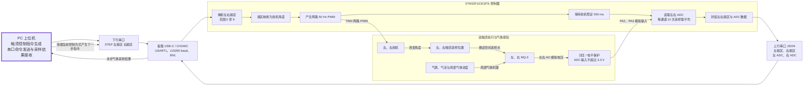

# 双触须主动嗅觉硬件架构草图

本图仅描述论文中的真实硬件闭环：上位机下发左右触须控制信号，STM32 驱动双舵机改变采样位置，双 MQ-3 完成气体采样，STM32 将左右 ADC 数据回传上位机。数据预处理、实验日志、指标计算和强化学习网络不属于本硬件架构图。

> 本文件是概念架构说明。自研 PCB 的连接器针序、电源树、分压参数、最小系统、网络命名和审图要求，以 [PCB 原理图接口规范](PCB_SCHEMATIC_INTERFACE_SPEC.md) 为唯一依据。

## 硬件控制与气体采集闭环



## 接口协议

上位机每次发送一条左右触须扇区命令：

```text
STEP <left_sector> <right_sector>\n
```

左右扇区均为整数 `0..9`。例如：

```text
STEP 3 7
```

STM32 完成舵机转动和双通道 ADC 采样后，返回一行 JSON：

```json
{"left_sector":3,"right_sector":7,"left_adc":1820,"right_adc":1765}
```

串口采用 USART1，参数为 `115200 baud、8 data bits、1 stop bit、no parity`。一次命令对应一次响应；上位机收到响应后才进入下一次控制与采样循环。

## 关键硬件接口

| 功能 | STM32 接口 | 信号方向 |
|---|---|---|
| 左舵机控制 | PA0 / TIM2 CH1 | STM32 → 左舵机 PWM |
| 右舵机控制 | PA1 / TIM2 CH2 | STM32 → 右舵机 PWM |
| 左 MQ-3 采样 | PA2 / ADC1 IN2 | 左 MQ-3 AO → STM32 ADC |
| 右 MQ-3 采样 | PA3 / ADC1 IN3 | 右 MQ-3 AO → STM32 ADC |
| 上位机通信 | PA9 TX、PA10 RX / USART1 | STM32 ↔ 板载 CH340C ↔ USB-C |
| SWD 下载调试 | PA13 SWDIO、PA14 SWCLK、NRST | ST-Link ↔ STM32 |

自研板使用外部稳压 5V（建议能力不低于 3A）给舵机和 MQ-3 供电；USB VBUS 仅可给 MCU/CH340C 逻辑域供电。两路 MQ-3 AO 必须先经过规范规定的分压滤波，再进入 PA2/PA3，禁止直接连接。

## 论文图注建议

> 双触须主动嗅觉硬件闭环。PC 上位机通过串口下发左右触须扇区指令，STM32 将扇区映射为两路舵机 PWM，使左右 MQ-3 在不同空间位置采样。舵机稳定后，STM32 对两路 MQ-3 模拟信号进行 ADC 采样和平均，并将扇区及 ADC 读数通过 JSON 串口报文返回上位机，形成“控制触须位置—采集气体响应—回传测量数据”的循环。
