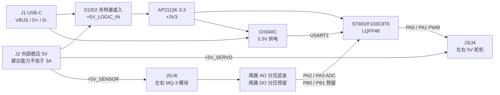

# 双触须主控板原理图接口规范

> 文档状态：首版原理图输入（V1）  
> 适用对象：原理图绘制、原理图审查、首板焊接与上电调试人员  
> 权威性：涉及自研 PCB 时，本文件优先于 `hardware/wiring/wiring_notes.md` 和固件目录中的开发板接线示例。

## 1. 设计目标与边界

本板用于固定基座双触须主动嗅觉实验，完成以下闭环：

```text
PC --USB-C/CH340C--> STM32F103C8T6
STM32 --两路 50 Hz PWM--> 左右舵机
左右 MQ-3 --两路 AO--> STM32 ADC
STM32 --115200 8N1--> PC
```

本版必须包含 STM32F103C8T6 最小系统、USB-C/CH340C 串口、两路舵机接口、两路 MQ-3 模块接口、5V/3.3V 电源树、SWD 下载接口和必要测试点。

本版不包含底盘电机驱动、裸 MQ-3 加热与负载电路、板载大功率 5V 降压、锂电池充电、正式量产级浪涌/EMC 设计、PCB 外形和安装孔定义。

## 2. 已锁定的系统方案



### 2.1 电源状态契约

| USB-C | 外部 5V | MCU/CH340C | 舵机 | MQ-3 | 预期用途 |
|---|---|---|---|---|---|
| 接入 | 未接 | 工作 | 断电 | 断电 | 下载、串口枚举、逻辑调试 |
| 未接 | 接入 | 工作 | 工作 | 工作 | 脱离 PC 的硬件供电检查 |
| 接入 | 接入 | 工作 | 工作 | 工作 | 正常实验 |
| 未接 | 未接 | 断电 | 断电 | 断电 | 完全关机 |

USB VBUS 不得直接连接 `+5V_SERVO` 或 `+5V_SENSOR`。D1、D2 必须阻止 USB VBUS 与外部 5V 互相反灌。

## 3. 外部连接器合同

连接器编号和针序为外部硬件接口，绘图、PCB 丝印和线束必须一致。J3～J6 使用带缺口或锁扣的 2.54 mm 防呆连接器；连接器视图必须在原理图中注明是“板端正视图”还是“焊接面视图”。

| 编号 | 名称 | 型号/形式 | 固定针序 |
|---|---|---|---|
| J1 | PC 通信 | USB-C、USB 2.0 Device、16 Pin | VBUS、D-、D+、GND、Shield |
| J2 | 外部 5V 输入 | 5.08 mm 两针端子，额定电流不低于 3A | 1=`+5V_EXT`，2=`GND` |
| J3 | 左舵机 | 2.54 mm 防呆 1×3 | 1=`GND`，2=`+5V_SERVO`，3=`PWM_LEFT` |
| J4 | 右舵机 | 2.54 mm 防呆 1×3 | 1=`GND`，2=`+5V_SERVO`，3=`PWM_RIGHT` |
| J5 | 左 MQ-3 模块 | 2.54 mm 防呆 1×4 | 1=`+5V_SENSOR`，2=`GND`，3=`MQ_L_AO`，4=`MQ_L_DO` |
| J6 | 右 MQ-3 模块 | 2.54 mm 防呆 1×4 | 1=`+5V_SENSOR`，2=`GND`，3=`MQ_R_AO`，4=`MQ_R_DO` |
| J7 | SWD 下载调试 | 2.54 mm 1×5 | 1=`+3V3`，2=`SWDIO`，3=`SWCLK`，4=`NRST`，5=`GND` |

### 3.1 外部器件约束

- J2 只能输入稳压 `5.0V`，设计检查上限按 `5.25V`；推荐电源持续输出能力不低于 `3A`。
- 舵机为小型 5V 舵机，控制输入必须能识别 3.3V 高电平。若更换大扭矩舵机，必须重新核算电源、连接器和铜箔载流能力。
- MQ-3 使用带 `VCC/GND/AO/DO` 的 5V 模块。不同模块排针顺序不统一，线束必须按 J5/J6 的板端针序重新制作，不能仅凭模块排针位置直连。
- MQ-3 的 DO 在当前固件中不用，但必须接入预留输入，便于后续实验。

## 4. STM32 引脚与固件合同

主控固定为 `STM32F103C8T6`、`LQFP48`。当前固件使用内部 HSI 8MHz，不要求外部高速或低速晶振。

| MCU 管脚 | LQFP48 脚号 | 外设功能 | 原理图网络 | 方向/电平 | 当前状态 |
|---|---:|---|---|---|---|
| PA0 | 10 | TIM2_CH1 | `PWM_LEFT_MCU` | 3.3V 输出 | 已用 |
| PA1 | 11 | TIM2_CH2 | `PWM_RIGHT_MCU` | 3.3V 输出 | 已用 |
| PA2 | 12 | ADC1_IN2 | `ADC_LEFT` | 0～3.3V 模拟输入 | 已用 |
| PA3 | 13 | ADC1_IN3 | `ADC_RIGHT` | 0～3.3V 模拟输入 | 已用 |
| PB0 | 18 | GPIO 输入 | `MQ_L_DO_3V3` | 0～3.3V 数字输入 | 预留，固件未启用 |
| PB1 | 19 | GPIO 输入 | `MQ_R_DO_3V3` | 0～3.3V 数字输入 | 预留，固件未启用 |
| PB2 | 20 | BOOT1 | `BOOT1` | 启动配置 | 10kΩ 下拉 |
| PA9 | 30 | USART1_TX | `MCU_TX` | MCU→CH340C | 已用 |
| PA10 | 31 | USART1_RX | `MCU_RX` | CH340C→MCU | 已用 |
| PA13 | 34 | SWDIO | `SWDIO` | 双向 | 已用 |
| PA14 | 37 | SWCLK | `SWCLK` | 输入 | 已用 |
| BOOT0 | 44 | BOOT0 | `BOOT0` | 启动配置 | 10kΩ 下拉、跳线可接 3V3 |
| NRST | 7 | 复位 | `NRST` | 低有效 | 上拉、电容、按钮、J7 |

### 4.1 舵机输出

- `PA0/TIM2_CH1` 为左舵机，`PA1/TIM2_CH2` 为右舵机，不允许互换。
- PWM 为高有效、`50Hz`，周期约 `20ms`；有效脉宽范围约 `0.5～2.5ms`。
- 每路 MCU 输出先串联 `220Ω`，连接器侧网络分别命名为 `PWM_LEFT`、`PWM_RIGHT`。
- 每个连接器侧 PWM 加 `10kΩ` 下拉，保证 MCU 复位和上电期间默认为低电平。

### 4.2 串口协议

CH340C TXD 接 `PA10/USART1_RX`，CH340C RXD 接 `PA9/USART1_TX`，两条 UART 线上分别串联 `1kΩ`。参数固定为 `115200 baud、8 data bits、1 stop bit、no parity、no flow control`。

PC 下发：

```text
STEP <left_sector> <right_sector>\n
```

左右扇区均为整数 `0..9`。STM32 返回：

```json
{"left_sector":3,"right_sector":7,"left_adc":1820,"right_adc":1765}
```

一次命令对应一次响应，上位机收到完整一行响应后再发送下一条命令。

## 5. 电源与最小系统电路要求

### 5.1 5V 输入和支路

- J2 Pin1 接 `+5V_EXT`，Pin2 接 GND；在 J2 旁放 `1000µF/10V` 电解和 `100nF` 陶瓷电容。
- `+5V_EXT` 分为 `+5V_SERVO` 与 `+5V_SENSOR` 两个命名支路。可使用 Net-Tie 保留支路边界，但不得用低额定电流的小封装 0Ω 电阻承载全部舵机电流。
- 舵机支路在 J3/J4 附近再放 `470µF/10V` 和 `100nF`；传感器支路放 `100µF/10V` 和 `100nF`。
- 首版按最小验证板实现：不装输入保险丝、防反接 MOS、TVS、负载开关和电流检测。J2 必须防呆并在丝印醒目标注 `5V`、`GND` 和极性，实验电源必须开启限流。

### 5.2 逻辑供电

- `USB_VBUS` 经 D1、`+5V_EXT` 经 D2 接入 `+5V_LOGIC_IN`；D1/D2 使用低压降肖特基二极管，如 `SS34`。
- `+5V_LOGIC_IN` 通过 `AP2112K-3.3/SOT-23-5` 生成 `+3V3`，EN 直接接 VIN。
- LDO 输入、输出按器件数据手册各放 `1µF`，并在逻辑母线增加 `10µF`；所有电容靠近相应管脚。
- `+3V3` 给 STM32、CH340C 和 SWD 参考电压供电；AO/DO 分压下端统一接 GND。不得由 SWD 接口反向给整板供电。

### 5.3 STM32 最小系统

- 三组 VDD/VSS 全部连接，且每个 VDD 就近放 `100nF`；芯片附近再放 `4.7µF` 总去耦。
- VDDA 从 3V3 经 `10Ω` 电阻形成 `+3V3_A`，VDDA 对 VSSA 放 `1µF + 100nF`；VSSA 接地。
- VBAT 直接接 3V3，并就近放 `100nF`。
- NRST 使用 `10kΩ` 上拉到 3V3、`100nF` 到地和复位按钮到地，同时引到 J7 Pin4。
- BOOT0 使用 `10kΩ` 下拉，JP1 可短接至 3V3；PB2/BOOT1 使用 `10kΩ` 下拉。
- 当前使用 HSI 8MHz，OSC_IN/OSC_OUT、PC14/PC15 不接晶振；未使用 MCU 管脚在原理图上明确标记 NC。

## 6. USB-C 与 CH340C

### 6.1 USB-C

- 使用仅支持 USB 2.0 的 16 Pin USB-C 母座。
- A6/B6 合并为 `USB_DP`，A7/B7 合并为 `USB_DM`；同名脚在连接器附近短接。
- CC1、CC2 各通过独立 `5.1kΩ` 接 GND，声明本板为 USB Device/UFP。
- D+、D- 各串联 `22Ω` 后连接 CH340C，电阻靠近 CH340C。
- Shield 焊脚在连接器附近直接接板级 GND。
- 预留 `USBLC6-2SC6` 或等效 USB ESD 器件焊盘，首版最小验证 BOM 标记为 DNP；DNP 时不得中断 D+/D- 主通路。

### 6.2 CH340C

CH340C 使用 SOP16 封装和内部时钟，不装 XI/XO 晶振。按 3.3V 模式连接：

| CH340C 脚 | 连接 |
|---|---|
| GND | GND |
| VCC | `+3V3`，旁路 `100nF` |
| V3 | 按 3.3V 供电模式接 `+3V3` |
| UD+ / UD- | 分别接 USB D+ / D- |
| TXD | 经 1kΩ 接 `MCU_RX/PA10` |
| RXD | 经 1kΩ 接 `MCU_TX/PA9` |
| XI/XO | CH340C 内部时钟模式，不接 |
| 其余握手脚 | 未使用，按数据手册标记 NC |

## 7. MQ-3 模拟与数字输入

### 7.1 AO 分压滤波

左右两路完全对称：

```text
MQ_x_AO -- 6.8kΩ --+-- ADC_x / STM32
                    |
                    +-- 10kΩ -- GND
                    |
                    +-- 100nF -- GND
```

分压系数为：

```text
10k / (6.8k + 10k) = 0.5952
```

因此模块 AO 为 5.25V 时，ADC 名义电压为约 3.125V。使用 1% 电阻并按最坏容差计算，ADC 电压仍不高于约 3.15V，低于 3.3V 供电域上限。

- 左路分压后网络为 `ADC_LEFT`，接 PA2/ADC1_IN2。
- 右路分压后网络为 `ADC_RIGHT`，接 PA3/ADC1_IN3。
- 电阻和 100nF 电容靠近 MCU ADC 管脚；在分压前后分别保留焊盘或测试点，以便核对模块 AO 与实际 ADC 电压。
- 当前返回的是 12-bit 原始 ADC 码值，不在下位机换算成模块端电压或浓度。

### 7.2 DO 预留

两路 DO 使用 `6.8kΩ/10kΩ` 分压，不加大容量滤波：

- `MQ_L_DO` 分压后为 `MQ_L_DO_3V3`，接 PB0。
- `MQ_R_DO` 分压后为 `MQ_R_DO_3V3`，接 PB1。
- 当前 `.ioc` 和固件不配置 PB0/PB1；首次制板测试不得依赖 DO。

## 8. 网络命名与测试点

原理图必须统一使用以下网络名，不使用 `NETxxx` 代替：

```text
+5V_EXT, USB_VBUS, +5V_LOGIC_IN, +5V_SERVO, +5V_SENSOR
+3V3, +3V3_A, GND
PWM_LEFT_MCU, PWM_LEFT, PWM_RIGHT_MCU, PWM_RIGHT
MQ_L_AO, MQ_R_AO, ADC_LEFT, ADC_RIGHT
MQ_L_DO, MQ_R_DO, MQ_L_DO_3V3, MQ_R_DO_3V3
MCU_TX, MCU_RX, USB_DP, USB_DM
SWDIO, SWCLK, NRST, BOOT0, BOOT1
```

至少提供以下测试点：

| 测试点 | 网络 |
|---|---|
| TP1 | `+5V_EXT` |
| TP2 | `+5V_LOGIC_IN` |
| TP3 | `+3V3` |
| TP4 | `GND` |
| TP5 / TP6 | `PWM_LEFT` / `PWM_RIGHT` |
| TP7 / TP8 | `ADC_LEFT` / `ADC_RIGHT` |
| TP9 / TP10 | `MCU_TX` / `MCU_RX` |

## 9. 首版建议器件/BOM 边界

| 类别 | 建议器件/规格 | 首版状态 |
|---|---|---|
| MCU | STM32F103C8T6，LQFP48 | 必装 |
| USB-UART | CH340C，SOP16 | 必装 |
| USB 接口 | USB-C USB2.0 16 Pin 母座 | 必装 |
| 3.3V LDO | AP2112K-3.3，SOT-23-5 | 必装 |
| 电源或入二极管 | SS34 或同等级肖特基，2 只 | 必装 |
| USB CC 电阻 | 5.1kΩ，1%，2 只 | 必装 |
| USB 数据串联电阻 | 22Ω，2 只 | 必装 |
| UART 串联电阻 | 1kΩ，2 只 | 必装 |
| PWM 串联/下拉 | 220Ω×2、10kΩ×2 | 必装 |
| AO/DO 分压 | 6.8kΩ×4、10kΩ×4，1% | 必装 |
| VDDA 滤波 | 10Ω×1、1µF×1、100nF×1 | 必装 |
| USB ESD | USBLC6-2SC6 或等效 | 预留，DNP |
| 电源保护 | 保险丝、防反接、TVS、负载开关 | 本版不画入 |

具体电容数量和封装由原理图按第 5～7 节逐项落实；所有电解电容耐压不低于 10V。

## 10. 原理图审查清单

交付原理图前逐项勾选：

- [ ] J1～J7 编号、针序、方向与第 3 节一致，丝印能区分 LEFT/RIGHT。
- [ ] PA0/PA1、PA2/PA3、PA9/PA10、PA13/PA14 未互换或复用。
- [ ] CH340C TXD 接 MCU RX，CH340C RXD 接 MCU TX。
- [ ] USB CC1、CC2 分别有 5.1kΩ 下拉；D+/D- 未交叉。
- [ ] USB VBUS 不向舵机或 MQ-3 供电；USB 与外部 5V 之间不存在直连反灌路径。
- [ ] J2 的 5V/GND 极性与端子、封装和丝印一致。
- [ ] 三组 STM32 VDD/VSS、VDDA/VSSA、VBAT 均已连接并去耦。
- [ ] NRST、BOOT0、BOOT1 和 SWD 接口完整。
- [ ] 两路 AO 分压和滤波完全对称，分压前后网络名不同。
- [ ] PB0/PB1 的 DO 分压已画入，但标注“固件暂未启用”。
- [ ] 舵机信号为 3.3V PWM，连接器电源来自 `+5V_SERVO`。
- [ ] MQ-3 电源来自 `+5V_SENSOR`，模块 AO 不得绕过分压直连 ADC。
- [ ] 所有必需电源脚已连接，所有未使用管脚明确标记 NC，ERC 无未解释错误。
- [ ] 测试点 TP1～TP10 已放置并标注。
- [ ] 首版未实现的保护功能在标题栏或设计备注中明确声明。

## 11. 首板上电与验收顺序

### 11.1 不装 MCU/外设的电源检查

1. 断电测量各电源对地阻值，确认无明显短路。
2. 仅接 USB，确认 `+5V_LOGIC_IN` 和 `+3V3` 正常，`+5V_SERVO/+5V_SENSOR` 为 0V。
3. 仅接限流 5V 实验电源，确认所有电源支路和 3.3V 正常。
4. 同时接 USB 和外部 5V，分别断开一侧，确认另一侧不被反向供电。

### 11.2 焊接后的功能验收

1. 检查 USB 枚举出 CH340 串口。
2. 通过 J7 使用 SWD 下载当前固件并验证复位。
3. 进行 UART 收发或 `STEP 5 5` 命令检查。
4. 不接 MQ-3，分别向 `MQ_L_AO/MQ_R_AO` 注入 0V、2.5V、5.0V，核对分压点和 ADC 码值。
5. 单独连接左舵机，再单独连接右舵机，检查方向、脉宽和电源压降。
6. 连接两只 MQ-3 并充分预热，检查 AO 不饱和且左右通道对应正确。
7. 最后运行双舵机、双 MQ-3 联合 smoke test：

```powershell
python scripts\hardware_smoke_test.py --port COM3
```

验收过程中若 5V 负载电源跌落、舵机复位 MCU、ADC 随舵机运动明显跳变，应先检查供电能力、共地和回流路径，不通过软件滤波掩盖硬件问题。

## 12. 参考资料

- [STM32F103C8 产品与数据手册入口](https://www.st.com/en/microcontrollers-microprocessors/stm32f103c8)
- [STM32F103 系列硬件开发应用笔记 AN2586 入口](https://www.st.com/en/microcontrollers-microprocessors/stm32f103/documentation.html)
- [WCH CH340 系列官方产品资料](https://www.wch-ic.com/products/productsCenter/otherChip?categoryId=68)
- 固件配置：`hardware/firmware/stm32_dual_whisker/whisker/whisker.ioc`
- 固件实现：`hardware/firmware/stm32_dual_whisker/whisker/Core/Src/main.c`
